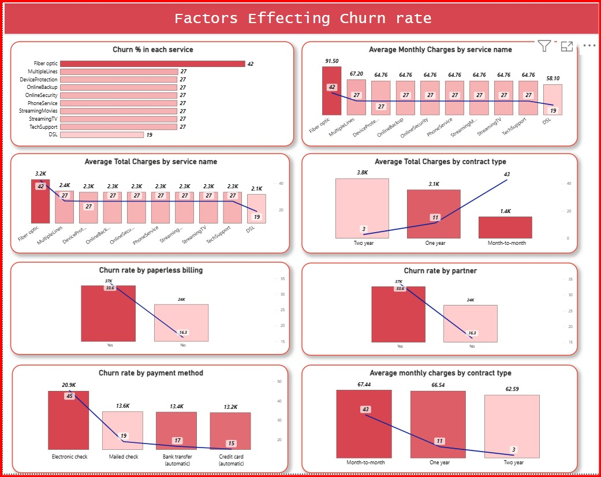

# 📊 Telecom Customer Churn Analysis – Power BI Project

This project provides an end-to-end analysis of **customer churn in a telecom company** using the IBM Telco dataset.  
The goal is to understand customer behavior, identify churn patterns, and provide business insights to improve retention.

---

## 🚀 Project Highlights
- **Churn rate analysis** at service, demographic, and contract levels.
- **Customer segmentation** by gender, dependents, senior citizens, and tenure.
- **Service-level insights** (Internet type, device protection, streaming, etc.).
- **Revenue impact** of churn through total charges and monthly charges.
- **Payment method and billing insights** to identify at-risk customers.

---

## 📸 Dashboard Previews

### 1️⃣ Factors Affecting Churn Rate
This dashboard highlights how churn varies across different services, billing types, partners, and contract categories.  
It helps identify **high-risk services** like Fiber Optic and Electronic Check customers.  

---

### 2️⃣ Customer Churn Overview
This dashboard gives a **complete overview of customers**, including churn rate, total customers lost, and revenue impact.  
It also explores **demographics and payment methods** to better understand churn behavior.  

---

## 🛠 Tools & Techniques
- **Power BI Desktop** – Dashboard creation & visual analytics  
- **Power Query** – Data cleaning and transformation  
- **DAX (Data Analysis Expressions)** – Custom measures for churn rate, extra charges %, and KPIs  

---

---

## 📢 Key Business Insights
- Customers with **Fiber Optic internet** have the highest churn rate (42%).  
- **Electronic check payment method** customers are more likely to churn.  
- Month-to-month contracts show significantly higher churn compared to yearly contracts.  
- Paperless billing has a noticeable impact on churn rate.  
- Senior citizens and customers with multiple services are more prone to churn.  

---

## 👤 Author
Created by **B.SIDDARTHA**  
📧 Contact: www.siddarthasid3@gmail.com  

⭐ If you found this project helpful, don’t forget to star this repo!
