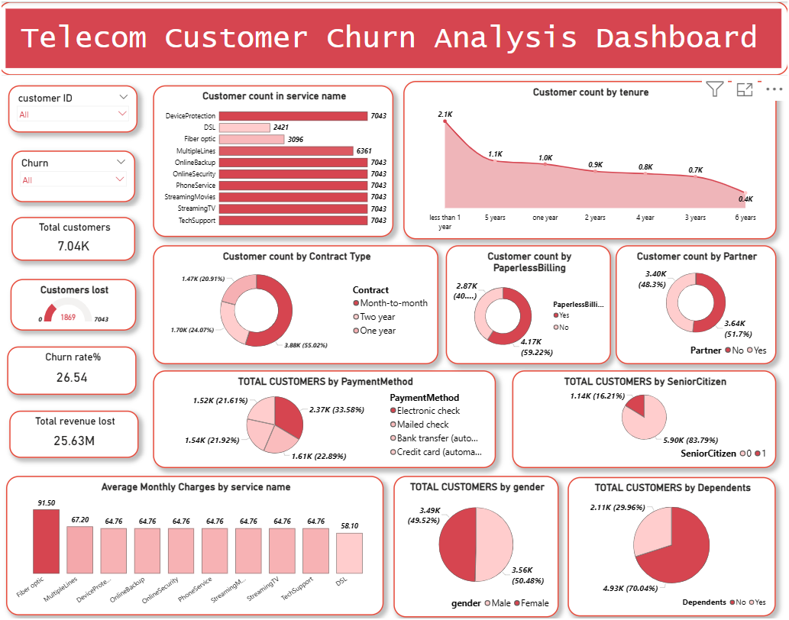

# 📊 Telecom Customer Churn Analysis – Power BI Project
## Project Objective

The goal is to understand customer behavior, identify churn patterns, and provide business insights to improve retention.

## Data source
The dataset is publicly available at https://www.kaggle.com/datasets/blastchar/telco-customer-churn  
The data set includes information about:

Customers who left within the last month – the column is called Churn.    
Services that each customer has signed up for – phone, multiple lines, internet, online security, online backup, device  
protection, tech support, and streaming TV and movies.    
Customer account information – how long they’ve been a customer, contract, payment method, paperless billing, monthly  
charges, and total charges.    
Demographic info about customers – gender, age range, and if they have partners and dependents.  
## Data Preparation
**1. Unpivot Services**  
The dataset originally had multiple service columns ( with values like Yes/No.)  
These columns were unpivoted to create two columns:  
**Service Name** — the name of the service  
**Value** — the subscription status (Yes or No)  

**2. Create Single Service Column**  
The Value column (Yes/No) was removed.
A single column was created showing only the services that each customer actually subscribed to.  
This column now contains the list of services per customer, simplifying analysis and visualization of  
customer subscriptions.

**3. Tenure Grouping**  
The tenure column (number of months a customer stayed) was grouped into categories:  
0-12 months → New Customers  
13-24 months → 1-2 Years  
25-48 months → 2-4 Years  
49-72 months → 4-6 Years  
73+ months → Long-term Customers    
These groups allow churn patterns to be studied across different customer tenures.  
## DAX Measures  
```bash
Churn rate=DIVIDE(CALCULATE( DISTINCTCOUNT('churntable'[CustomerID]),KEEPFILTERS('churntable'[Churn] =TRUE())),CALCULATE(DISTINCTCOUNT('churntable'[CustomerID]),  
REMOVEFILTERS('churntable'[Churn])))*100
```
```bash
Total customers = DISTINCTCOUNT(churntable[customerID])
```
```bash
Count of Churned customers = CALCULATE(DISTINCTCOUNT('churntable'[CustomerID]),KEEPFILTERS('churntable'[Churn] = TRUE()))
```
```bash
TOTAL revenue lost = CALCULATE(sum(churntable[TotalCharges]),KEEPFILTERS('churntable'[Churn]=TRUE()))
```

## Data Visualisation using POWER BI
## 📸 Dashboard Previews


### 1️⃣ Customer Churn Overview
This dashboard gives a **complete overview of customers**, including churn rate, total customers lost, Number 
of customers based on paper less billing, dependents,having partners, gender,
payment method.This Dashboard gives clear distribution of customers, who are churned,
not churned and can help us see both combined.
It  explores **demographics and payment methods** to better understand churn behavior.  




### 2️⃣  Factors Affecting Churn Rate
This dashboard highlights how churn varies across different services, billing types, partners,average
monthly charges,average total charges,average monthly charges of different contract type and contract categories.  
It helps identify **high-risk services** in serives, payment methods,contract types,monthly charges.  


---

---

## 🛠 Tools & Techniques
- **Power BI Desktop** – Dashboard creation & visual analytics  
- **Power Query** – Data cleaning and transformation  
- **DAX (Data Analysis Expressions)** – Custom measures for churn rate,count of Total customers, count of churned customers,Total revenue lost

---
## 🚀 Project Highlights
- **Churn rate analysis** at service, demographic, and contract levels.
- **Customer segmentation** by gender, dependents, senior citizens, and tenure.
- **Service-level insights** (Internet type, device protection, streaming, etc.).
- **Revenue impact** of churn through total charges and monthly charges.
- **Payment method and billing insights** to identify at-risk customers.


---

## 📢 Key Business Insights
- Customers with **Fiber Optic internet** have the highest churn rate (42%).  
- **Electronic check payment method** customers are more likely to churn.  
- Month-to-month contracts show significantly higher churn compared to yearly contracts.  
- Paperless billing has a noticeable impact on churn rate.  
    

---

## 👤 Author
Created by **B.SIDDARTHA**  
📧 Contact: www.siddarthasid3@gmail.com  

⭐ If you found this project helpful, don’t forget to star this repo!
